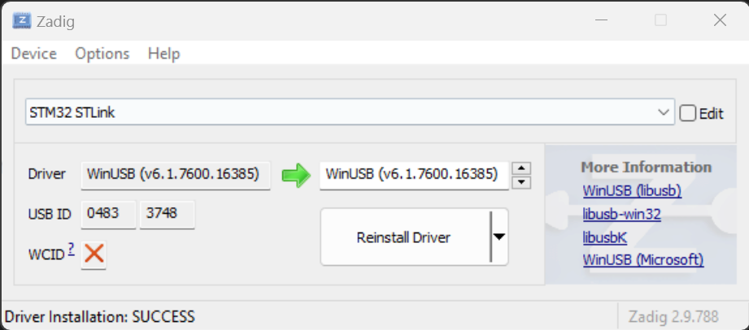

# BlackPillTemplate

## Get the template
```
$ git clone https://github.com/casartar/BlackPillTemplate.git
```
## Installation Manjaro
```
$ sudo pacman -S code
$ sudo pacman -S cmake
$ sudo pacman -S ninja
$ sudo pacman -S arm-none-eabi-gcc
$ sudo pacman -S arm-none-eabi-newlib
$ sudo pacman -S arm-none-eabi-gdb
$ sudo pacman -S openocd
```

## Installation Windows

### Download
1. https://code.visualstudio.com/download
2. https://cmake.org/download/ (Binary distribution ZIP)
3. https://github.com/ninja-build/ninja/releases (ninja-win.zip)
4. https://github.com/openocd-org/openocd/releases/latest (openocd-vxx.x-i686-mingw32.tar.gz)
5. https://developer.arm.com/downloads/-/arm-gnu-toolchain-downloads (Windows (mingw-w64-i686) hosted cross toolchains ZIP)

### Copy to C://STM32Toolchain
Should look like this:


### Add to path
```
C:\STM32Toolchain\arm-gnu-toolchain-13.3.rel1-mingw-w64-i686-arm-none-eabi\bin
C:\STM32Toolchain\cmake-3.30.1-windows-x86_64\bin
C:\STM32Toolchain\openocd-v0.12.0-i686-w64-mingw32\bin
C:\STM32Toolchain\ninja-win
```
Should look like this:


Restart vscode to apply path variables

### Driver Shizzle for cheap fucking ST-Link clone
1. Install Zadig. Download from https://zadig.akeo.ie/
2. Replace Driver


## Compile the template

### Manjaro
```
$ cd BlackPillTemplate
$ chmod +x init_ninja.sh
$ ./init_ninja.sh
$ cd build
$ ninja
```

### Windows
```
$ cd BlackPillTemplate
$ cmake -B build -G "Ninja" -DCMAKE_TOOLCHAIN_FILE="cmake/gcc-arm-none-eabi.cmake" -DCMAKE_BUILD_TYPE:STRING="Debug"
$ cd build
$ ninja
```

## Prepare vscode for debugging
- Install vscode Extension marus25.cortex-debug
- Install vscode Extension ms-vscode.cpptools

If ms-vscode.cpptools is not available use "Download Extension" on the right side of https://marketplace.visualstudio.com/items?itemName=ms-vscode.cpptools and install the vsix file manually.

## Docs you need
1. https://www.st.com/resource/en/reference_manual/dm00096844-stm32f401xb-c-and-stm32f401xd-e-advanced-arm-based-32-bit-mcus-stmicroelectronics.pdf
2. https://www.st.com/resource/en/datasheet/stm32f401cc.pdf
3. https://deepbluembedded.com/stm32f411-black-pill-board-pinout-schematic-datasheet/

## Challenges

### Challenge 1
1. Make the LED blink using for loop to waste some time.

### Challenge 2
1. Make pin B10 an input with pullup.
2. If B10 is connected to GND the LED must be on and off otherwise.

### Challenge 3
Configure the USART to send 'c' all the time.
1. Enable the clock for the USART and GPIOA
2. Configure alternate function on GPIO PA9. Search for "Alternate function mapping" in the Datasheet to find the correct alternate function
3. Be careful the alternate function register is represented as an array.
4. Search for "Procedure" in the USART chapter and follow the instruction there.
    1. For calculating the baudrate the chapter "Fractional baud rate generator", "Example 2" and the Table "Error calculation for programmed baud rates at f_PCLK = 16 MHz, oversampling by 16" will help.
5. Let the USART send 'c' in the same frequency as the LED was blinking in the challenge before. 


