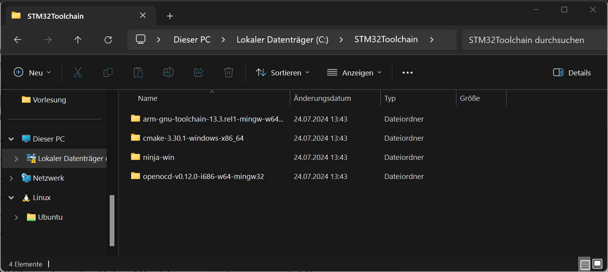

# BlackPillTemplate

## Get the template
```
$ git clone https://github.com/casartar/BlackPillTemplate.git
```
## Installation Manjaro
```
$ sudo pacman -S code
$ sudo pacman -S cmake
$ sudo pacman -S ninja
$ sudo pacman -S arm-none-eabi-gcc
$ sudo pacman -S arm-none-eabi-newlib
$ sudo pacman -S arm-none-eabi-gdb
$ sudo pacman -S openocd
```

## Installation Windows

### Download
1. https://code.visualstudio.com/download
2. https://cmake.org/download/ (Binary distribution ZIP)
3. https://github.com/ninja-build/ninja/releases (ninja-win.zip)
4. https://github.com/openocd-org/openocd/releases/latest (openocd-vxx.x-i686-mingw32.tar.gz)
5. https://developer.arm.com/downloads/-/arm-gnu-toolchain-downloads (Windows (mingw-w64-i686) hosted cross toolchains ZIP)

### Copy to C://STM32Toolchain
Should look like this:


### Add to path
```
C:\STM32Toolchain\arm-gnu-toolchain-13.3.rel1-mingw-w64-i686-arm-none-eabi\arm-gnu-toolchain-13.3.rel1-mingw-w64-i686-arm-none-eabi\bin
C:\STM32Toolchain\cmake-3.30.1-windows-x86_64\bin
C:\STM32Toolchain\openocd-v0.12.0-i686-w64-mingw32\bin
C:\STM32Toolchain\ninja-win
```
Should look like this:


Restart vscode to apply path variables

### Driver Shizzle for cheap fucking ST-Link clone
1. Delete original  driver
2. Install Zadig. Download from https://zadig.akeo.ie/
3. Replace Driver


## Compile the template
```
$ cd BlackPillTemplate
$ chmod +x init_ninja.sh
$ ./init_ninja.sh
$ cd build
$ ninja
```

## Prepare vscode for debugging
- Install vscode Extension marus25.cortex-debug
- Install vscode Extension ms-vscode.cpptools

If ms-vscode.cpptools is not available use "Download Extension" on the right side of https://marketplace.visualstudio.com/items?itemName=ms-vscode.cpptools and install the vsix file manually.


